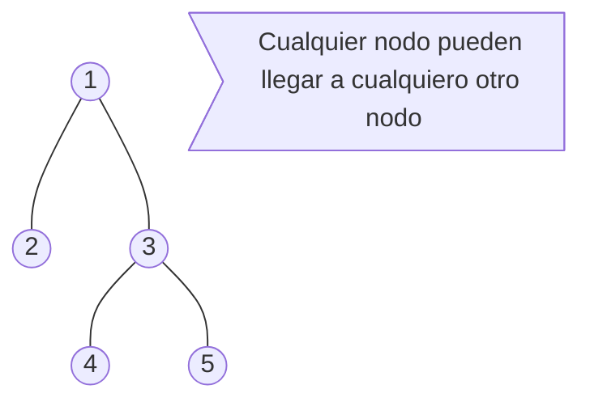
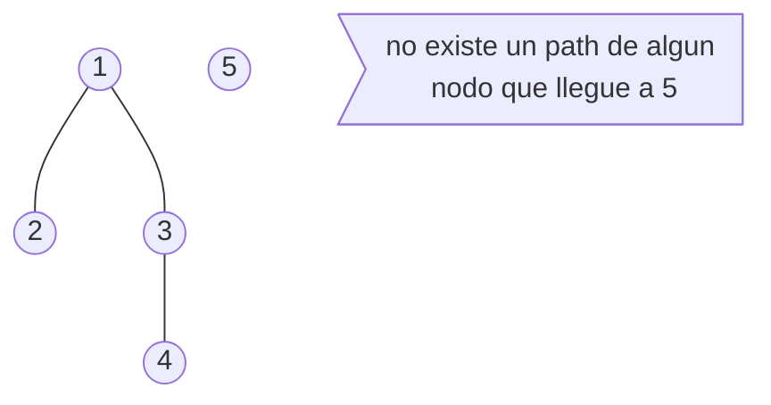
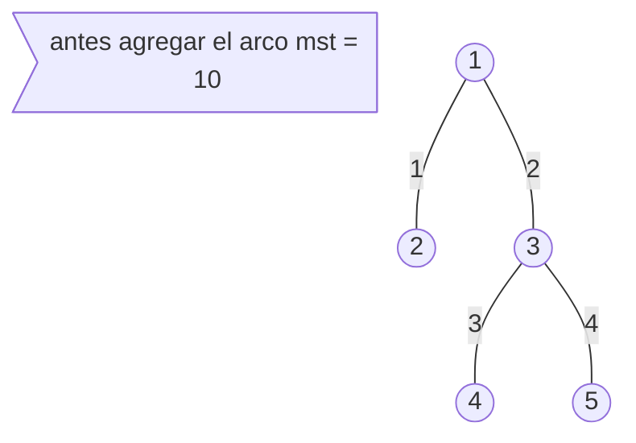
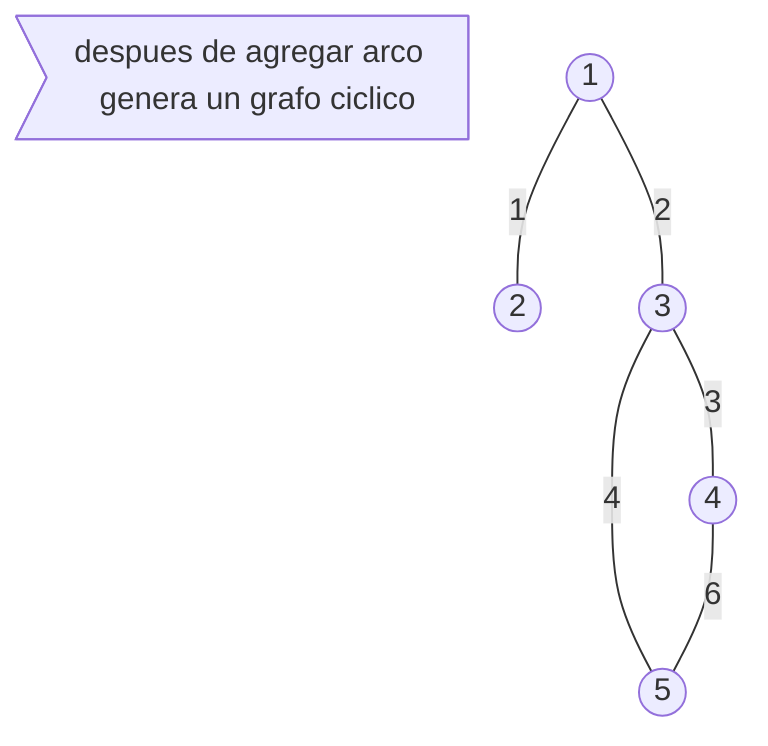
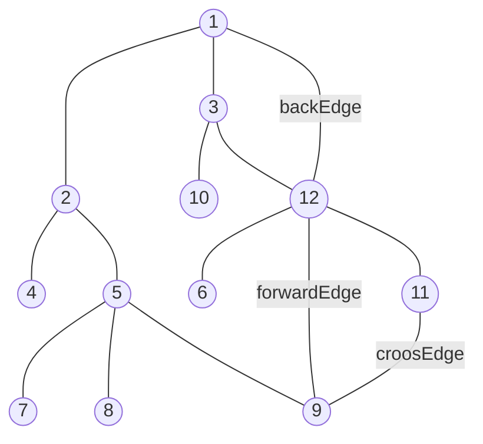

# PARA VIZUALISAR MERJO ESTE .md [CLICK AQUI](https://stackedit.io)
# 8196 - Imperial roads

[8196 - Imperial roads](https://icpcarchive.ecs.baylor.edu/index.php?option=com_onlinejudge&Itemid=8&page=show_problem&category=&problem=6218&mosmsg=Submission+received+with+ID+2563018)

## Contenido

1. [Problema](#Problema)
2. [Observacion](#Observacion)
3. [Por qué este problema](#Por-qué-este-problema)
4. [Posibles soluciones](#Posibles-soluciones)
5. [Solucion](https://github.com/CrkJohn/CompetitiveProgramming/blob/master/UVa/Python/8196.py)
6. [Solucion Eficiente utilizando LCA]()


## Problema
Las carreteras de Cubiconia están en mal estado, después de años de abandono y falta de mantenimiento. Cada camino conecta dos ciudades diferentes **A** y **B** y se puede viajar en ambas direcciones. Hay a lo sumo una carretera entre cada par de ciudades, y usando las carreteras existentes es posible para viajar entre cualquier par de ciudades. El nuevo emperador de Cubiconia acaba de subir los impuestos (¡otra vez!), pero prometió reparar al menos algunas de las carreteras, garantizando que los cubicones puedan viajar. entre cualquier par de ciudades usando sólo carreteras restauradas.

El Departamento de Obras Públicas ha calculado el coste de reparación de cada una de las carreteras. Ahora quieren calcular **el coste mínimo de reparación** de un conjunto de carreteras para que la promesa del emperador se haga realidad. Esto no es fácil porque el emperador quiere que el conjunto de caminos reparados **incluya un camino en particular**, pero aún no ha decidido qué camino en particular incluir: podría ser el que conecta la ciudad donde está su castillo con la ciudad donde está la residencia real de su hija, o el camino que conecta la ciudad donde está su palacio de verano con la única ciudad a la orilla del mar, o. . . Temiendo que el emperador tarde demasiado en decidir, los ingenieros quieren tu ayuda.

Dada la descripción de las carreteras de Cubiconia, con sus respectivos costos de reparación, usted debe escribir un programa para responder a **un conjunto de consultas**. Para cada consulta se le dará una ruta específica que
debe ser reparado, y debe determinar el costo mínimo de reparación de un conjunto de caminos (incluyendo el de manera que los cubicones puedan viajar entre cualquier par de ciudades usando solamente carreteras restauradas
### Input
La primera línea contiene dos números enteros N $(2 ≤ N ≤ N ≤ 10^5)$ y R $(N-1 ≤ R ≤ 2 × 10^5)$, que representan respectivamente el número de ciudades y el número de carreteras en Cubiconia. Cada una de las siguientes líneas de la R describe una carretera con tres números enteros A, B  $(1 ≤ A < B ≤ N)$ y C  $(1 ≤ C ≤ 10^4 )$ lo que indica que hay una carretera entre las ciudades **A** y **B** y que el coste de su reparación es **C**. Hay como máximo una carretera entre cada par de ciudades, y utilizando el comando carreteras existentes es posible viajar entre cualquier par de ciudades. La siguiente línea contiene un número entero Q $(1 ≤ Q ≤ 10^5)$ que representa el número de consultas. Cada una de las siguientes líneas Q describe una consulta con dos números enteros U y V $(1 ≤ U < V ≤ N)$, indicando la carretera específica que debe ser reparada. No hay
consultas repetidas

### Output
Por cada consulta el coste mínimo de reparación de un conjunto de carreteras (incluida la carretera en cuestión en la consulta)

## Observación
### Qué es el segundo arbol de espansion minima
Sea $T$  el Árbol de expansión mínima de un grafo $G$. Se puede observar que el segundo mejor Árbol de expansión mínima difiere de $T$ por un solo reemplazo de arcos.
(Para una prueba de esta afirmación, consulte el problema 23-1 [aquí](http://www-bcf.usc.edu/~shanghua/teaching/Spring2010/public_html/files/HW2_Solutions_A.pdf)).

### Qué se necesita encontrar

Necesitamos encontrar un nuevo borde que no esté en $T$, y reemplazarlo con un arco en $T$ de tal forma que el nuevo arbol de expansión mínima del grafo $T′=(T∪{e_{new}})∖{e_{old}}$ sea un árbol que abarque todo y la diferencia de peso ($e_{new}-e_{old})$ sea mínima.

### Qué sucede al intruducir un nuevo arco de en  $T$

Sea $T$ un arbol de espansion minima de $G$, siendo  $T$  un grafo completamento conexo, es decir, hay un camino de aristas que una cualquier par de vértices.

Ejemplos de un grafo convexo

Ejemplos de un grafo no convexo



Al hacer la operacion $T∪{e_{new}}$, denotando $e$ como un nuevo arco para el arbol $T$, nos  genera un ciclo por que este nuevo arco al intruducido a $T$ sería un [Cross Edge o un  Back Edge](#Tipos-de-arcos).





Se pude evidenciar que el arbol $T$ se convierte un  grafo  $G'_{ciclico}$ sin embargo tenemos que eliminar un arco $G_{ciclico}$ para que asi sea nuevo un arbol $T'$, preferiblemente para este problema que estamos buscando el segundo arbol de espasion minima deberiamos que eliminar  el arco maximo(mayor peso) que ya estaba en $T$ antes de agregar $e_{new}$ concluyengo asi un nuevo valor para *MST*.

## Por qué este problema

Es un problema clásico donde si no se hace adecuadamente el ejercicio puede tener muchos problemas por *TIME LIMIT*, Este es un ejercicio donde cotas del grafo $n$ y $m$, $n$ siendo la cantidad máxima de nodos y $m$ siento la máxima cantidad de arcos en el grafo, tienen demasiada importancia porque así podemos determinar que método de solución realizar, a demás este ejercicio nos brinda la oportunidad de aprender como recorrer un árbol adecuamente si se quieren hacer $Q$ queries.
## Posibles soluciones

### Greedy
Este problema lo podemos solucionar greedy, la solucion es muy sencilla es guardar un identificador para arco descrito en la lista de arcos en el input del ejercicio y por cada $Q_{th}$  unir ese arco antes que los demás arcos al arbol $T$, no es una solución demasiado eficiente debido a:
##### Complejidad
* El tiempo que se demora el algoritmo seria $O(Q* M*log_{N} + Nlog_{N} )$,  y complejidad espacial $O(M + Q*N)$, M por una lista de arcos incialmente y Q*N por la inicializacion del arreglo *P* y *R* del UnionFind

### Precalcular usando DFS
Ejecute el Algoritmo de Kruskal de forma normal, guardando los bordes del arbol de espacion minimo puede ser como una lista de adyacencia   y guardar el valor MST del primer arbol de espancion minimo despues de 
esto debemos precalcular maximo arco  entre el nodo $i_{th}$ y  el nodo $j_{th}$, ahora por cada $e_{new}$ para $T$ tenemos minimizar el costo del MST, que sería con la siguiente formula.
 $$MST - maxEdge[u][v] + cost[u][v]$$
$maxEdge[i][j] =$ maximo peso entre node i - j 
$costo[i][j] =$ Es el costo  entre node i - j  incialmente

##### Complejidad
* La complejidad de solucionar este ejercicio seria  $O(Q + N+M + Nlog_{m})$ y complejidad espacial $O(N*N + M + N)$
##### Problemas de esta solucion
* El problema más grande esta solucion es el espacion en memoria que necesitamos utilizar para precalcular $maxEdge$ entre $i - j$, asi mimos si el grafo es demasiado esperso la complejidad de la dfs puede salirnos costosa en tiempo.
##### Implementacion de la matriz maxEdge
```python
	#in main function
	global maxEdge
	maxEdge = [ [ 0 for i in range(N)] for j in range(N)]
	for nodes,listTree in enumerate(tree):
		if listTree:
		dfs(nodes,nodes,tree)
	  
	def dfs(src, u ,tree):
		global maxEdge
		for node in tree[u]:
			if maxEdge[src][node.to] > 0:
				continue
			maxEdge[src][node.to] = max(maxEdge[src][u],node.w)
			dfs(src,node.to,tree)
```
[Implementacion completa del ejercicio]([https://github.com/CrkJohn/CompetitiveProgramming/blob/master/UVa/Python/8196.py](https://github.com/CrkJohn/CompetitiveProgramming/blob/master/UVa/Python/8196.py))
### LCA
##### Complejidad


## Tipos de arcos
Los backEdge apuntan desde un nodo a uno de sus ancestros en el árbol.
Los forward Edge apuntan desde un nodo a uno de sus descendientes.
Los cross Edge apuntan desde un nodo a un nodo previamente visitado que no es ni un antepasado ni un descendiente.



